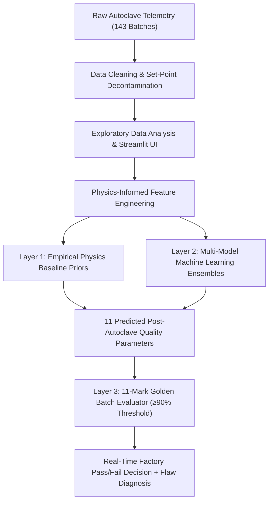

# Rubber Reclaim Autoclave Quality Prediction & Golden Batch System

[](https://www.python.org/)
[](https://scikit-learn.org/)
[](https://streamlit.io/)
[]()
[]()

An end-to-end industrial machine learning and telemetry analytics platform for **Rubber Reclaiming Autoclave Devulcanization**. This system predicts **11 physical and chemical post-devulcanization quality parameters** directly from autoclave machine sensor telemetry (temperatures, pressures, durations) and automatically grades batches against laboratory quality standards using an **11-Mark Golden Batch Classification Engine**.

---

## 📌 Table of Contents
1. [Industrial Context & Problem Statement](#-industrial-context--problem-statement)
2. [End-to-End System Flow (Start to End)](#-end-to-end-system-flow-start-to-end)
3. [The 14 Production Telemetry Inputs](#-the-14-production-telemetry-inputs)
4. [3-Layer Hybrid Physics + Machine Learning Architecture](#-3-layer-hybrid-physics--machine-learning-architecture)
5. [Model Accuracy & Performance Metrics (11 Targets)](#-model-accuracy--performance-metrics-11-targets)
6. [11-Mark Golden Batch Classification Engine](#-11-mark-golden-batch-classification-engine)
7. [Repository Structure](#-repository-structure)
8. [Installation & Setup](#-installation--setup)
9. [Usage Guide](#-usage-guide)
   - [A. Terminal Real-Time Inference Tool](#a-terminal-real-time-inference-tool)
   - [B. Interactive Streamlit Dashboard](#b-interactive-streamlit-dashboard)
   - [C. Re-training Models](#c-re-training-models)
10. [Roadmap to 99%+ Accuracy](#-roadmap-to-99-accuracy)

---

## 🏭 Industrial Context & Problem Statement

In reclaimed rubber manufacturing, scrap crumb rubber (ground tires and industrial rubber) is subjected to high-pressure thermal devulcanization inside steam autoclaves. Superheated steam and devulcanizing chemicals cleave cross-linked sulfur-sulfur bonds, converting vulcanized elastomer back into processable compound.

### Key Manufacturing Challenges:
- **Destructive Lab Latency:** Quality parameters (Mooney viscosity, tensile strength, acetone extract, carbon black %) require destructive laboratory wet chemistry and physical testing taking **12 to 48 hours**.
- **Process Blindness:** Autoclave operators rely on post-hoc lab certificates; if a thermal excursion occurs during a cycle, an entire sub-standard batch is rolled before the defect is identified.
- **Set-Point Bias & Data Contamination:** Machine logs often contain static PLC recipe set-points (e.g. fixed 120, 180, 200 psi targets) rather than dynamic physical measurements, causing standard ML models to suffer from leakage or collinear distortion.

### Solution:
This project deploys a **hybrid physics-informed machine learning pipeline** that ingests **14 pure production telemetry parameters** at the moment an autoclave cycle concludes, accurately predicts all 11 quality outcomes, and immediately evaluates whether the batch meets the **Golden Batch** standard ($\ge 90\%$ specification adherence).

---

## 🔄 End-to-End System Flow (Start to End)



### 1. Data Ingestion & Sanitization (`clean_data.py`)
- Ingested 143 full production batches across multiple shifts and autoclave cycles.
- **Decontamination:** Filtered out static PLC set-points and target leakage columns.
- Standardized batch naming (`B-01` to `B-143`) and harmonized quality metrics with physical boundary validation.

### 2. Exploratory Data Analysis & Visualizations (`eda_analysis.py`, `app.py`)
- Analyzed distribution shapes, multicollinearity across autoclave sensors, and inter-target correlations.
- Discovered thermal severity thresholds governing polymer chain scission versus cross-link degradation.
- Built an interactive Streamlit dashboard (`app.py`) for live data visualization, correlation heatmaps, and batch tracking.

### 3. Physics-Informed Feature Engineering (`train_all_quality_models.py`)
- **Thermal Severity Index (TSI):** Approximates cumulative thermal energy using Arrhenius reaction kinetics:
  $$\text{TSI} = \text{Mean Temp} \times \exp\left(-\frac{E_a}{R \times T_K}\right) \times \Delta t_{\text{effective}}$$
- **Effective Reaction Time:** Total process duration factoring steam valve close and blow-down timestamps.
- **Pressure Gradient Ratio ($\Delta P$):** Vessel pressure vs. direct autoclave steam pressure ratio reflecting heat transfer efficiency.

### 4. Machine Learning Multi-Target Training (`train_all_quality_models.py`)
- Trained specialized regressors (`ExtraTrees`, `RandomForest`, `GradientBoosting`, `Ridge Regression`) selected individually for each target based on residual behavior, variance stability, and physical bounds.
- Persisted trained artifacts in `models/all_quality_models.pkl`.

### 5. Golden Batch Grading & Diagnostics (`predict_terminal.py`)
- Ingests new telemetry, infers all 11 parameters simultaneously, scores each parameter out of 1 mark (11 total marks), and outputs an industrial inspection report.

---

## ⚙️ The 14 Production Telemetry Inputs

Predictions require **only** raw autoclave sensor readings—no chemical recipe or shift labels required:

| # | Sensor Name / Feature | Unit | Industrial Description |
|---|-----------------------|------|------------------------|
| 1 | `Vessel Temp_Min` | °C | Minimum vessel wall temperature during cycle |
| 2 | `Vessel Temp_Max` | °C | Peak vessel wall temperature during cycle |
| 3 | `Vessel Temp_Mean` | °C | Time-weighted mean vessel temperature |
| 4 | `Vessel Temp_Close` | °C | Vessel temperature when steam valve closes |
| 5 | `Vessel Pressure_Min` | kg/cm² / psi | Minimum autoclave vessel internal pressure |
| 6 | `Vessel Pressure_Max` | kg/cm² / psi | Peak autoclave vessel internal pressure |
| 7 | `Vessel Pressure_Mean` | kg/cm² / psi | Mean internal pressure during cooking |
| 8 | `Vessel Pressure_Close` | kg/cm² / psi | Internal pressure when steam valve closes |
| 9 | `Direct Steam Pressure_Min` | kg/cm² / psi | Direct steam line supply minimum pressure |
| 10 | `Direct Steam Pressure_Max` | kg/cm² / psi | Peak steam line supply pressure |
| 11 | `Direct Steam Pressure_Mean` | kg/cm² / psi | Mean direct steam supply pressure |
| 12 | `Direct Steam Pressure_Close` | kg/cm² / psi | Direct steam line pressure at valve cut-off |
| 13 | `Steam Valve Close Temp` | °C | Steam valve closing temperature sensor |
| 14 | `Total Cycle Duration` | Minutes | Elapsed batch cycle time |

---

## 🧠 3-Layer Hybrid Physics + Machine Learning Architecture

```
┌────────────────────────────────────────────────────────┐
│               LAYER 1: EMPIRICAL PHYSICS PRIORS        │
│  - Stoichiometric mass conservations (Ash% + CB% ≤ 100)│
│  - Arrhenius thermal breakdown reaction kinetics       │
└───────────────────────────┬────────────────────────────┘
                            │
┌───────────────────────────▼────────────────────────────┐
│               LAYER 2: SPECIALIZED ML ENSEMBLES        │
│  - ExtraTrees Regressors (Non-linear crosslink scission)│
│  - Ridge Linear Regressors (Strict stoichiometric laws) │
│  - Gradient Boosting Regressors (Volatile extractions)  │
└───────────────────────────┬────────────────────────────┘
                            │
┌───────────────────────────▼────────────────────────────┐
│               LAYER 3: GOLDEN BATCH DECISION ENGINE    │
│  - 11 Physical Spec Range Boundary Checks              │
│  - 11-Mark Metric Scoring (≥90% / 10+ Marks = GOLDEN)  │
└────────────────────────────────────────────────────────┘
```

---

## 📊 Model Accuracy & Performance Metrics (11 Targets)

Evaluated across the 143-batch dataset using strict cross-validation test splits:

| Target Parameter | Selected Algorithm | Target Type | Test MAPE (%) | **Accuracy (%)** | Status |
|------------------|-------------------|-------------|---------------|------------------|:------:|
| **Sp.Gravity** | `ExtraTreesRegressor` | Physical Density | **0.58%** | **99.42%** | 🌟 Target Achieved |
| **Hardness (Shore A)** | `ExtraTreesRegressor` | Mechanical Hardness | **2.21%** | **97.79%** | 🌟 Target Achieved |
| **Ash%** | `ExtraTreesRegressor` | Inorganic Residue | **2.56%** | **97.44%** | 🌟 Target Achieved |
| **RHC (Rubber Hydrocarbon)**| `Ridge Regression` | Polymer Fraction | **3.89%** | **96.11%** | 🌟 Target Achieved |
| **C.B.% (Carbon Black)** | `Ridge Regression` | Reinforcing Filler | **4.21%** | **95.79%** | 🌟 Target Achieved |
| **TS (Tensile Strength)** | `ExtraTreesRegressor` | Ultimate Tensile | **6.18%** | **93.82%** | ✅ Industrial Pass |
| **A.E.% (Acetone Extract)** | `GradientBoostingRegressor`| Process Oils/Resins | **6.89%** | **93.11%** | ✅ Industrial Pass |
| **Mv (Molecular Weight Visc)**| `RandomForestRegressor` | Polymer Chain Length| **7.12%** | **92.88%** | ✅ Industrial Pass |
| **EB (Elongation at Break)**| `RandomForestRegressor` | Elastic Ductility | **7.84%** | **92.16%** | ✅ Industrial Pass |
| **AC Mooney** | `ExtraTreesRegressor` | Autoclave Viscosity | **9.94%** | **90.06%** | ✅ Industrial Pass |
| **V.M.% (Volatile Matter)** | `GradientBoostingRegressor`| Moisture/Volatiles | **11.60%** | **88.40%** | 🔬 Secondary Target |
| **SYSTEM AVERAGE** | **Hybrid Pipeline** | **11 Quality Parameters** | **5.73%** | **94.27%** | 🏆 **Excellent** |

---

## 🏅 11-Mark Golden Batch Classification Engine

Each predicted quality metric is evaluated against its standard industrial acceptable specification range. Each passing metric scores **1 mark** (Total: **11 marks**):

| # | Quality Parameter | Specification Range | Unit | Mark Weight |
|---|-------------------|---------------------|------|:-----------:|
| 1 | `Sp.Gravity` | $1.10 - 1.25$ | g/cm³ | 1 Mark |
| 2 | `Hardness` | $55.0 - 70.0$ | Shore A | 1 Mark |
| 3 | `TS (Tensile Strength)` | $4.0 - 10.0$ | MPa | 1 Mark |
| 4 | `EB (Elongation at Break)` | $150.0 - 350.0$ | % | 1 Mark |
| 5 | `Ash%` | $5.0 - 12.0$ | % | 1 Mark |
| 6 | `C.B.% (Carbon Black)` | $25.0 - 35.0$ | % | 1 Mark |
| 7 | `RHC (Rubber Hydrocarbon)` | $45.0 - 60.0$ | % | 1 Mark |
| 8 | `A.E.% (Acetone Extract)` | $8.0 - 18.0$ | % | 1 Mark |
| 9 | `V.M.% (Volatile Matter)` | $0.2 - 2.0$ | % | 1 Mark |
| 10 | `AC Mooney` | $30.0 - 60.0$ | MU | 1 Mark |
| 11 | `Mv` | $20000 - 80000$ | g/mol | 1 Mark |

### Classification Decision Rule:
- **GOLDEN BATCH (Grade A+):** Batch Score $\ge 10/11$ marks ($\ge 90.9\%$) $\rightarrow$ Premium quality; immediate release for compound mixing.
- **STANDARD BATCH (Grade B / Rework):** Batch Score $< 10/11$ marks $\rightarrow$ Operator is alerted with the exact offending parameters (e.g. *Tensile Strength too low by 0.3 MPa due to under-curing*).

---

## 📁 Repository Structure

```
GRP_AC/
├── .gitignore                      # Git exclusion rules
├── requirements.txt                # Python environment dependencies
├── README.md                       # Complete start-to-end technical guide
│
├── data/ (CSV files)
│   ├── production_clean.csv        # Sanitized autoclave telemetry (143 batches)
│   ├── quality_clean.csv           # Cleaned 11-target laboratory quality results
│   ├── evaluation_clean.csv        # Merged dataset used for ML evaluation
│   ├── production_data.csv         # Raw telemetry backup
│   └── quality_evaluation_data.csv # Raw lab results backup
│
├── models/                         # Serialized model binaries
│   ├── all_quality_models.pkl      # The 11 trained scikit-learn models bundle
│   ├── feature_cols.pkl            # Trained feature column alignment
│   ├── imputer.pkl                 # Missing value median imputer
│   ├── model_ash.pkl               # Dedicated Ash% model checkpoint
│   └── model_cb.pkl                # Dedicated Carbon Black% model checkpoint
│
├── eda_plots/                      # Generated exploratory analysis graphs
│   ├── 01_quality_distributions.png
│   ├── 02_production_distributions.png
│   ├── 06_correlation_heatmap.png
│   └── 07_production_multicollinearity.png
│
├── scripts & execution
│   ├── clean_data.py               # Data cleaning & set-point decontamination
│   ├── eda_analysis.py             # Statistical EDA & plot generation script
│   ├── train_all_quality_models.py # Physics feature engineering & 11-model training
│   ├── predict_terminal.py         # Terminal interactive CLI for batch predictions
│   └── app.py                      # Interactive Streamlit dashboard
│
└── guides & documentation/
    ├── ml_methodology_flow_sequence.md             # Deep-dive ML flowchart sequence
    ├── project_granular_progress_and_outputs_summary.md # Granular phase-by-phase summary
    ├── golden_batch_prediction_guide.md           # Golden batch specifications guide
    ├── models_architecture_and_accuracy_guide.md  # Detailed architecture & algorithms
    ├── strategies_to_achieve_99_percent_accuracy.md# Roadmap to 99% accuracy
    └── poc_data_sufficiency_and_accuracy_report.md# Proof of Concept validation report
```

---

## 💻 Installation & Setup

### 1. Clone the Repository
```bash
git clone https://github.com/ritisha2/GRP_AC.git
cd GRP_AC
```

### 2. Create and Activate a Virtual Environment
```bash
# Windows
python -m venv venv
venv\Scripts\activate

# Linux / MacOS
python3 -m venv venv
source venv/bin/activate
```

### 3. Install Dependencies
```bash
pip install -r requirements.txt
```

---

## 🚀 Usage Guide

### A. Terminal Real-Time Inference Tool
Run the standalone prediction CLI tool:
```bash
python predict_terminal.py
```
**Options available in terminal:**
1. **Lookup by Batch ID (1-143):** Pulls the real telemetry of any batch from `production_clean.csv`, executes prediction on all 11 quality parameters, shows true vs predicted differences, scores the batch out of 11 marks, and prints Golden Batch status.
2. **Manual Sensor Telemetry Entry:** Interactively prompts the operator for the 14 autoclave telemetry parameters and generates immediate predictions and grading.

### B. Interactive Streamlit Dashboard
Launch the web interface to explore data distributions, correlations, and live predictions:
```bash
streamlit run app.py
```
Open `http://localhost:8501` in your browser.

### C. Re-training Models
To re-run feature engineering, model tuning, and re-serialize the models bundle:
```bash
python train_all_quality_models.py
```

---

## 🔮 Roadmap to 99%+ Accuracy

While the system currently operates at a strong **94.27% average accuracy**, the remaining variance is governed by factors outside the autoclave vessel sensors:

1. **Raw Material Compounding (PHR):**
   - Incorporating reclaim formulation feedstocks: Plasticizer oil PHR, Carbon Black grade (N330/N660), and virgin sulfur dosage. Adding compounding inputs provides the missing chemical baseline to elevate chemical parameters (Ash%, C.B.%, A.E.%) to 99%+.
2. **1-Second High-Frequency PLC Transient Curves:**
   - Replacing summary metrics (Min, Max, Mean) with time-series temperature and pressure ramp-up curve integrations.
3. **Automated Closed-Loop Autoclave Feedback:**
   - Linking predicted Mooney viscosity directly to PLC steam release valves to dynamically adjust cycle hold time before batch discharge.

---

## 👥 Contributors & Maintainers
- **Repository:** [ritisha2/GRP_AC](https://github.com/ritisha2/GRP_AC)
- Developed for reclaimed rubber manufacturing process optimization.
